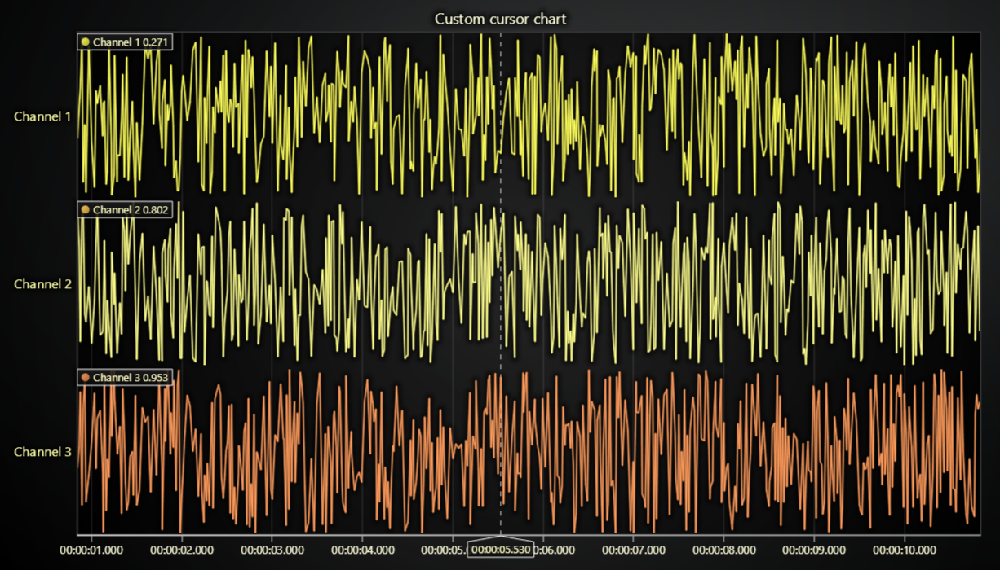
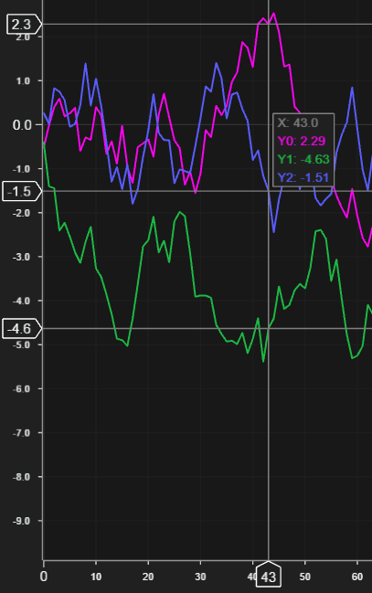

# JavaScript Custom Cursor Chart



This demo application belongs to the set of examples for LightningChart JS, data visualization library for JavaScript.

LightningChart JS is entirely GPU accelerated and performance optimized charting library for presenting massive amounts of data. It offers an easy way of creating sophisticated and interactive charts and adding them to your website or web application.

The demo can be used as an example or a seed project. Local execution requires the following steps:

-   Make sure that relevant version of [Node.js](https://nodejs.org/en/download/) is installed
-   Open the project folder in a terminal:

          npm install              # fetches dependencies
          npm start                # builds an application and starts the development server

-   The application is available at _http://localhost:8080_ in your browser, webpack-dev-server provides hot reload functionality.


## Description

This example serves as an example for creating a custom cursor for XY charts.

Custom cursors can be required for different purposes - like major structural changes or very application specific styling requirements.

If lesser changes to default cursors are required then please see read about different methods of configuring cursor behavior - `ChartXY` API reference has good links and explanations to follow.

Custom cursors are most importantly based on `LCJS` methods that allow solving nearest data points in series from any supplied location.
Custom user interactions and data point solving require solid understanding of different coordinate systems in web and `LCJS`, which is the primary reason this example exists;

```javascript
// Add custom action when user moves mouse over series area.
chart.onSeriesBackgroundMouseMove((_, event) => {
    // `event` is a native JavaScript event, which packs the active mouse location in `clientX` and `clientY` properties.
    // it can be used for solving nearest data point ...
    const nearestDataPoint = series.solveNearestFromScreen(event)

    // ... or translated to a pair of Axes
    const mouseLocationAxis = chart.translateCoordinate(event, chart.coordsAxis)
})
```

In this example, the custom cursor visual is created with internal `LCJS` user interface components, showcasing a _multi-cursor_ which displays one X coordinate and several Y coordinates at once.



The result table is created by combining `LCJS` layout elements with `UITextBox` elements - this allows any kind of value grid to be created.

More custom cursor examples can be found by looking for "cursor" tag in the _Interactive Examples_ gallery - for example, using HTML & CSS for an animated result table or connecting to an UI framework.


## API Links

* [Lightning Chart top reference]
* [Auto cursor modes]
* [UI element builders]
* [UI layout builders]
* [UI backgrounds]
* [UI position origin]
* [Color factory hexadecimal]
* [Color factory css]
* [Solid fill style]
* [Solid line style]
* [Chart XY]
* [Axis XY]
* [Custom tick]


## Support

If you notice an error in the example code, please open an issue on [GitHub][0] repository of the entire example.

Official [API documentation][1] can be found on [LightningChart][2] website.

If the docs and other materials do not solve your problem as well as implementation help is needed, ask on [StackOverflow][3] (tagged lightningchart).

If you think you found a bug in the LightningChart JavaScript library, please contact support@lightningchart.com.

Direct developer email support can be purchased through a [Support Plan][4] or by contacting sales@lightningchart.com.

[0]: https://github.com/Arction/
[1]: https://lightningchart.com/lightningchart-js-api-documentation/
[2]: https://lightningchart.com
[3]: https://stackoverflow.com/questions/tagged/lightningchart
[4]: https://lightningchart.com/support-services/

© LightningChart Ltd 2009-2022. All rights reserved.


[Lightning Chart top reference]: https://lightningchart.com/js-charts/api-documentation/v4.2.0/interfaces/LightningChart.html
[Auto cursor modes]: https://lightningchart.com/js-charts/api-documentation/v4.2.0/enums/AutoCursorModes.html
[UI element builders]: https://lightningchart.com/js-charts/api-documentation/v4.2.0/variables/UIElementBuilders.html
[UI layout builders]: https://lightningchart.com/js-charts/api-documentation/v4.2.0/variables/UILayoutBuilders.html
[UI backgrounds]: https://lightningchart.com/js-charts/api-documentation/v4.2.0/variables/UIBackgrounds.html
[UI position origin]: https://lightningchart.com/js-charts/api-documentation/v4.2.0/variables/UIOrigins.html
[Color factory hexadecimal]: https://lightningchart.com/js-charts/api-documentation/v4.2.0/functions/ColorHEX.html
[Color factory css]: https://lightningchart.com/js-charts/api-documentation/v4.2.0/functions/ColorCSS.html
[Solid fill style]: https://lightningchart.com/js-charts/api-documentation/v4.2.0/classes/SolidFill.html
[Solid line style]: https://lightningchart.com/js-charts/api-documentation/v4.2.0/classes/SolidLine.html
[Chart XY]: https://lightningchart.com/js-charts/api-documentation/v4.2.0/classes/ChartXY.html
[Axis XY]: https://lightningchart.com/js-charts/api-documentation/v4.2.0/classes/Axis.html
[Custom tick]: https://lightningchart.com/js-charts/api-documentation/v4.2.0/classes/CustomTick.html

